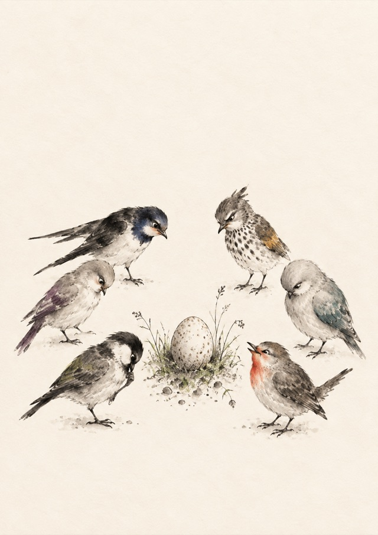

# polyglot-notebook



A personal project about learning several languages in one paper notebook: a blank Midori MD A6 with 176 pages. English is the main language, with sections for Polish, Spanish, Basque and Belarusian, a reserve slot for one more language, and a little Latin. Sections are marked with coloured tabs on the fore edge of the notebook.

## Site

- English: https://tanya-ok.github.io/polyglot-notebook/
- Russian: https://tanya-ok.github.io/polyglot-notebook/ru/

## What is here

- `site/index.html` - layout ideas page: page allocation bar, colour system, edge-tab map, page mockups, five switchable styles, print kit previews.
- `site/ru/index.html` - the same page in Russian.
- `site/assets/polyglot-notebook-md-a6.pdf` - print kit, 13 pages at 105 × 148 mm: cover, field guide, seven section dividers, four inserts (Word garden, Phrasebook, Small review, Error garden).
- `site/assets/polyglot-notebook-md-a6-print-a4.pdf` - the same pages 4-up on A4 at 100% scale; sheet 4 is a refill sheet with all four inserts.
- `content/ru/notebook-starter-content.md` - starter content per language (tables, rules, constructions, phrases), keyed to notebook page numbers. In Russian.

## Run locally

```bash
python3 -m http.server 8000 --bind 127.0.0.1 --directory site
```

Then open http://127.0.0.1:8000/

## Languages

| Code | Language | Role |
|---|---|---|
| EN | English | main |
| PL | Polish | active |
| ES | Spanish | active |
| EU | Basque | active |
| BE | Belarusian | maintenance, every example in Cyrillic and łacinka |
| +1 | reserve | slot for one more language |
| LA | Latin | reading only |

## Page allocation

| Section | Pages | Count |
|---|---|---|
| front matter | 1-7 | 7 |
| EN | 8-37 | 30 |
| PL | 38-52 | 15 |
| ES | 53-67 | 15 |
| EU | 68-82 | 15 |
| BE | 83-92 | 10 |
| +1 reserve | 93-107 | 15 |
| LA | 108-111 | 4 |
| shared spreads | 112-119 | 8 |
| open section | 120-155 | 36 |
| lists from the back | 156-176 | 21 |

## Licence

- Code: MIT, see [LICENSE](LICENSE).
- Page content (texts, layouts, starter content, print kit, illustration): [CC BY 4.0](https://creativecommons.org/licenses/by/4.0/).
- Fonts embedded in the PDFs stay under their owners' licences.
